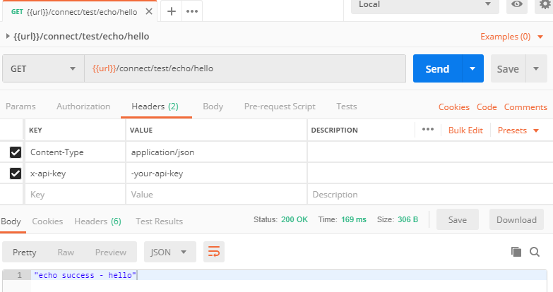
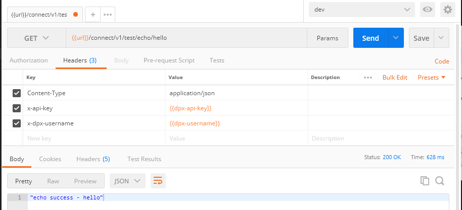

## Overview
-  [DPX Technology](#dpx-general)
    -  [Architecture](#architecture)
    -  [Technical Stacks](#tech-stacks)
-  [DPX Connect Api](#connect-api)
    -  [Overview](#connect-api)
    -  [Authentication](#connect-api-auth)
    -  [Example Request](#connect-api-request)
    -  [V1 Specification](#connect-api-specification)
    -  [Changelog](#connect-api-changelog)

### DPX Technology
DPX is financial pricing software built on the modern web application architecture and technical stacks.

You can find more product information from [Brilliance website](https://bxfin.com/).

####  Architecture
- SPA (Single Page Application)
- RESTful API
- Layered Architecture

####  Technical Stacks
- Asp.NET Core
- Angular
- Entity Framework Core
- SQL Server
- Cloud Data Storage

### DPX Connect API
DPX Connect API provides RESTful api for pricing integration. You can use the API to request pricing integration tasks with standard GET,POST,PUT,DELETE http methods.

- Latest Version : Connect Api V1

####  Authentication
To access the APIs, the client system should include `x-api-key` in the request HTTP header.

You can get the api-key from tenant admin page or your system admin.

#### Impersonating as an existing user
You can also execute an API under a specific DPX user context. By impersonating the user, all actions will be executed and audited as the impersonating user. For doing this an additional request header, `x-dpx-username` can be sent as part of the request. The username passed in the header must be a valid and active user.

> Note that when using impersonation, user must have access to the actions being performed in the API, otherwise the request may fail with Http 403 error.

####  Example Request

To request, you need to include the following http headers.

- `Content-Type`: application/json
- `x-api-key`: your-api-key
- `x-dpx-username`: DPX username under whose context the API will execute [optional]

Refer the Postman example to request echo endpoint

[GET] `/connect/test/echo`

**Sample Request**

**Sample Request _with user-impersonation_**

####  API V1 Specification

DPX provides public Swagger documents for the latest API specification.

- <a href="https://dev.dpxpricing.com/swagger" target="_blank">Connect API V1 document</a>

####  API Changelog
- [Change Log](ApiChangeLog.md)